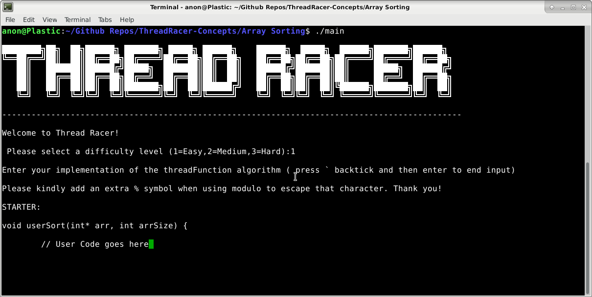
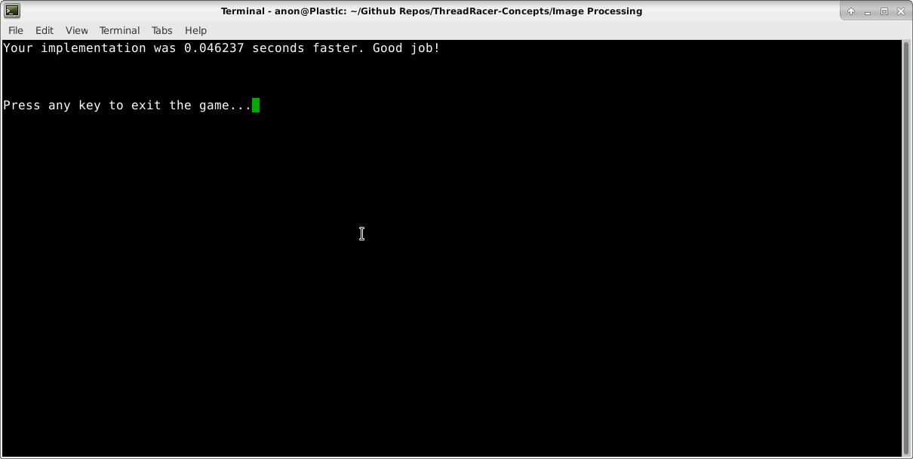
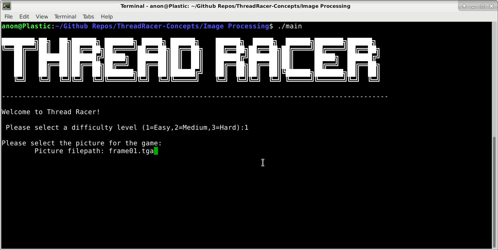
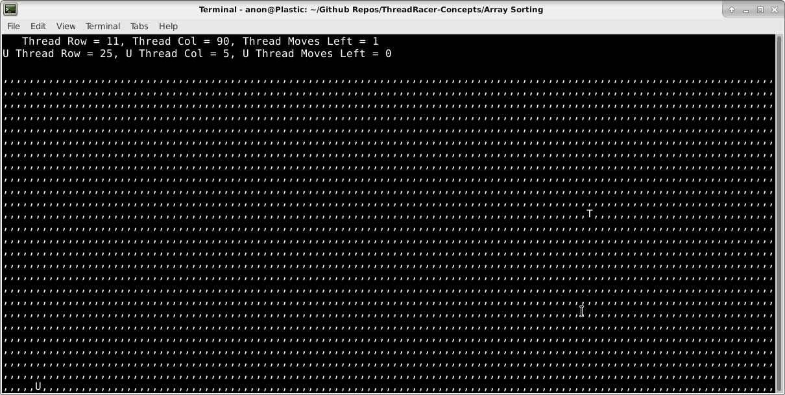

# ThreadRacer-Concepts

# What is This?

ThreadRacer Concepts is a collection of optimization challenges that prompt
the user to code a solution for a certain problem. The user's algorithm is tested
against a simple solution that is not optimized. The speedup is displayed to determine
whether the user won the game.

The algorithms that can be tested include array sorting, image processing, and prime factorization.

One concept (array sorting) includes a semi-functional graphical application that assigns a speed
to some characters moving across a grid according to the speed of the code of the user who controls them.

The games are intended to get programmers thinking about optimizations like loop unrolling,
cache blocking, and use of common subexpressions.

# Installation (On Debian Stretch)

Installation just requires the virtual package "libncurses-dev"

	sudo apt install libncurses-dev
	
# Compiling

Compile in any of the concept subdirectories with the following command
	
	gcc main.c -lpthread -o main
	
If the above command has linker issues (may occur on some distros), use the following command
	
	gcc main.c -lpthread -lncurses -o main
	
# Running

Running the code is as easy as running the executable you created. No arguments are necessary
	
	e.g.
	
	./main
	
Follow the onscreen instructions to play the game!
	

	